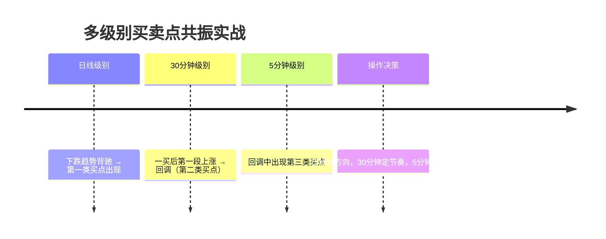

# 缠论买卖点规则

## 总论

三类买卖点是缠论中100%安全的买卖点。这三类买卖点都被理论所保证，是市场中唯一值得信赖的操作依据。

**缠中说禅买卖点完备性定理**：市场必然产生赢利的买卖点，只有第一、二、三类。

**缠中说禅升跌完备性定理**：市场中的任何向上与下跌，都必然从三类缠中说禅买卖点中的某一类开始以及结束。

---

## 第一类买点

### 定义（第12、14课）
用比较形象的语言描述：由男上位（空头排列）最后一吻后出现的背驰式下跌构成。

### 精确定义
某级别下跌趋势中，最后一个中枢之后的背驰段出现背驰，形成的第一类买点。

### 识别条件
1. 走势处于下跌趋势中（至少两个同向中枢）
2. 最后一个中枢之后出现背驰
3. 背驰可以通过以下方式判断：
   - 均线系统：趋势力度（均线交叉面积）逐次减弱
   - MACD：C段对应的MACD柱子面积小于A段
   - 中枢分析：离开中枢的力度小于前一段

### MACD辅助判断（第24课）
- 第一类买点都是在0轴之下背驰形成的
- A、B、C三段中，B段的中枢会把MACD的黄白线回拉到0轴附近
- C段的MACD柱子面积（向下看绿柱子）比A段面积小

### 安全性
**绝对安全**。因为下跌走势完成后只能转化为上涨或盘整，无论哪种情况都会产生利润。

### 操作策略
- 第一类买点是最佳的抄底位置
- 买入后一旦出现盘整，应考虑退出（针对中小资金的"下跌+上涨"买卖方法）

---

## 第一类卖点

### 定义
与第一类买点对称。女上位（多头排列）最后一吻后出现的背驰式上涨构成。

### 精确定义
某级别上涨趋势中，最后一个中枢之后的背驰段出现背驰，形成的第一类卖点。

### 识别条件
1. 走势处于上涨趋势中（至少两个同向中枢）
2. 最后一个中枢之后出现背驰
3. C段的MACD红柱子面积小于A段

### MACD辅助判断
- 第一类卖点都是在0轴之上背驰形成的
- 价格创新高，但MACD柱子面积或高度不创新高

---

## 第二类买点

### 定义（第12、14、17课）
女上位（多头排列）第一吻后出现的下跌构成。

### 精确定义
第一类买点出现后，第一次次级别回调的低点。

### 识别条件
1. 已经出现第一类买点
2. 从第一类买点开始的上涨结束后，出现第一次回调
3. 回调的低点不破第一类买点

### 重要定律（第14课）
**缠中说禅买点定律**：大级别的第二类买点由次一级别相应走势的第一类买点构成。

例如：周线上的第二类买点由日线上相应走势的第一类买点构成。

### 安全性
**绝对安全**。因为走势必完美要求上涨和盘整在图形上必须完成，因此后面必然至少还有一个向上的次级别运动。

### 位置分析
- 中枢下出现：其后力度值得怀疑，出现扩张性中枢可能性极大
- 中枢中出现：出现中枢扩张与新生的机会对半
- 中枢上出现：中枢新生的机会很大

### 操作策略
- 买的时候最好在第二类买点
- 第二类买点是精确把握的要点：可通过降低K线级别从次级别寻找最佳买点

---

## 第二类卖点

### 定义
与第二类买点对称。男上位（空头排列）第一吻后出现的上涨构成。

### 精确定义
第一类卖点出现后，第一次次级别反弹的高点。

### 识别条件
1. 已经出现第一类卖点
2. 从第一类卖点开始的下跌结束后，出现第一次反弹
3. 反弹的高点不过第一类卖点

---

## 第三类买点

### 定义（第20课）
一个次级别走势类型向上离开缠中说禅走势中枢，然后以一个次级别走势类型回试，其低点不跌破ZG（中枢上沿），则构成第三类买点。

### 识别条件
1. 存在一个明确的中枢
2. 一个次级别走势向上离开中枢
3. 回试的次级别走势低点不跌破ZG = min(g1, g2)
4. 必须是第一次回试

### 关键细节（第53课）
- 离开中枢必须是次级别，回试也必须是次级别
- 在中枢上方有一个次级别的中枢并不能绝对保证安全（如跳空后的岛型反转）
- 第三类买卖点后可以演化成更大级别的震荡

### 次级别趋势离开的特殊情况（第37课补充）
- 离开中枢的次级别趋势中，第二个次级别中枢不触及原中枢的情况，可以看成第三类买点
- 条件：下上下中后下低于前下，或上下上中后上高于前上

### 后续走势
第三类买点后必然出现两种情况之一：
1. 形成上涨趋势（中枢新生）
2. 进入更大级别盘整（中枢扩张）

### 操作策略
- 适合短线技术较好的资金
- 一旦不能出现趋势，一定要在盘整的高点出掉
- 最有效的第三类买点是底部第一个中枢产生的

### 次级别趋势离开的特殊情况详解（第53课思考贴9）

#### 问题：次级别趋势离开时，第二个次级别中枢不触及中枢的情况是否第三类买卖点？

以下几种教材原文涉及此问题：

**课程18（中枢定理三）**：两个次级别走势的组合只有三种：趋势+盘整、趋势+反趋势、盘整+反趋势。否认了次级别趋势中包含第三类买卖点。

**课程24**：用MACD判断背驰的前提描述中，说明了最后一个中枢的破坏即第三类买卖点是包含在离开中枢的次级别趋势中。

**课程92**：中枢震荡中次级别类型的重要性 -- 最后一个次级别中枢在中枢之外的，一旦下一个次级别走势在该次级别中枢区间完成，震荡就会出现变盘。

#### 当前结论

**关于次级别趋势离开时，第二个次级别中枢不触及中枢的情况是否第三类买卖点：**

1. 可以看成3买，但必须满足：下上下中后下低于前下，或上下上中后上高于前上
2. 可以看成3买，但必须在高级别图上形成次级别结构（如5分中枢的1分趋势离开，在5分图上应形成线段）

**关于次次级别离开、次级别回抽是否属于第三类买卖点：**

- 原则同上，可以算，但离开的次次级别这段必须在高级别图形上形成次级别结构
- 例：5分中枢，次次级别离开这段中不含1分中枢，而这段在5分图上形成1段，则回抽的1分走势不回中枢可看成是第三类买卖点

**关于次级别是否可以盘整+盘整形式：**

- 从缠2008-1-8解盘可见，第三类买卖点可以是盘整+盘整形式
- 一个盘整类型的次级别偏移后的第三类买点，总是不那么激动人心

---

## 第三类卖点

### 定义
一个次级别走势类型向下离开缠中说禅走势中枢，然后以一个次级别走势类型回抽，其高点不升破ZD（中枢下沿），则构成第三类卖点。

### 识别条件
1. 存在一个明确的中枢
2. 一个次级别走势向下离开中枢
3. 回抽的次级别走势高点不升破ZD = max(d1, d2)
4. 必须是第一次回抽

---

## 类二买

### 定义
上涨趋势中的第一个上涨中枢横盘突破后形成。

### 识别条件
1. 中枢方向向上
2. 中枢后的走势向上突破中枢
3. 突破后形成新的向上走势

### 操作意义
- 类二买是第二类买点的变体
- 出现在中枢突破后，可视为追涨信号
- 强度通常不如标准第二类买点

---

## 买卖点之间的关系

### 不可能重合的情况
- 第一类买点与第二类买点：前后出现，不可能重合
- 第一类买点与第三类买点：一个在中枢之下、一个在中枢之上，不可能重合

### 可能重合的情况
- **第二类买点与第三类买点可以重合**：
  当第一类买点出现后，一个次级别走势凌厉地直接上破前面下跌的最后一个中枢，然后在其上产生一个次级别的回抽不触及该中枢，这时就会出现第二类买点与第三类买点重合。

  一旦出现这种情况，一个大级别的上涨往往就会出现。

### 第二、三类买卖点之间的关系（第53课）

在第二、三买卖点之间，都是中枢震荡，这时候是不会有该级别的买卖点的。因此，如果参与其中的买卖，用的都是低级别的买卖点。

### 三类买卖点的综合应用（第53课）

- 第一类买卖点是最佳的，足以应付最大多数情况，但对小转大情况无能为力
- 第二类买卖点是对第一类的补充，特别在小转大情况下是最佳的（因为此时没有该级别的第一类买卖点）
- 第三类买卖点是针对中枢结束的
- 站在同一级别上，三者都重要，不能偏废

### 小级别大幅突破的操作（第54课）

在大幅快速波动的情况下，一个小级别的第三类买卖点就足以值得介入：
- 例如对一个周线中枢的突破，如果真要等周线级别的第三类买卖点，那就要日线级别的离开和反抽
- 一个30分钟甚至5分钟的第三类买卖点都足以介入
- **前提**：这种小级别的大幅突破必须和一般的中枢波动分开，伴随最猛烈快速的走势，成交量以及力度等都要相应配合
- 理论不熟练的，还是先按最简单的来（如对周线中枢的突破，就老老实实等周线的第三类买点）
- **卖点原则**：宁愿按小的来，因为宁愿卖早，决不卖晚

---

## 操作原则总结

### 买卖原则
- **买的时候一般最好在第二个买点**
- **卖尽量在第一个卖点**
- 这是买和卖不同的地方

### 短差程序（第14课）
**缠中说禅短差程序**：大级别买点介入的，在次级别第一类卖点出现时，可以先减仓，其后在次级别第一类买点出现时回补。

### 完整操作流程
1. 在第一类买点买入
2. 持有等待第一个卖点（女上位缠绕后出现背驰）
3. 或等待第二个卖点（变成男上位的第一个缠绕高点）
4. 卖出完成一个完整的操作

### 风险控制
- 第一买点的风险：把中继判断为转折，把背驰判断错
- 第二买点的风险：把转折判断成中继
- 所有操作都应设置防护：一旦变为不能搞，立刻从买入程序中退出

---

## 缠论六大定律

### 1. 缠中说禅买点定律（第14课）

**大级别的第二类买点由次一级别相应走势的第一类买点构成。**

例如：周线上的第二类买点由日线上相应走势的第一类买点构成。

### 2. 缠中说禅买卖点定律一（第35课）

**任何级别的第二类买卖点都由次级别相应走势的第一类买点构成。**

这样，任何由第一、二类买卖点构成的缠中说禅买卖点，都可以归结到不同级别的第一类买点。

### 3. 缠中说禅趋势转折定律（第35课）

**任何级别的上涨转折都是由某级别的第一类卖点构成的；任何的下跌转折都是由某级别的第一类买点构成的。**

注意：这某级别不一定是次级别，因为次级别里可以是第二类买卖点，而且还有不同级别同时出现第一类买卖点的情况（同步共振）。

### 4. 缠中说禅MACD定律

**第一类买点都是在0轴之下背驰形成的，第二类买点都是第一次上0轴后回抽确认形成的，卖点情况反过来。**

### 5. 缠中说禅定律（走势分解）

**任何非盘整性的转折性上涨，都是在某一级别的"下跌＋盘整＋下跌"后形成的，下跌反之。**

### 6. 缠中说禅走势分解定理

**任何级别的任何走势类型，都至少由三段以上次级别走势类型构成。**

这是基于中枢至少包含三段次级别走势类型得出的结论。

---

## 线段与买卖点的对应关系

### 核心：线段端点是买卖点的几何学基础

缠论原文明确指出：**"线段的端点是某级别三类缠中说禅买卖点中的某一类。"** 线段划分不是独立的技术游戏，而是买卖点定位的几何学基础。

买卖点从本质上说就是**线段结束的点**，特征序列的分型就是买卖点形成的几何结构。

---

### 买卖点的线段层级映射

| 买卖点类型 | 线段结构本质 | 特征序列信号 | 级别对应 |
|-----------|-------------|-------------|---------|
| **第一类买点** | 下跌线段（下降趋势）的最后一段出现背驰 → 线段结束 | 下跌线段特征序列底分型 + 背驰确认 | 本级别下跌线段结束 |
| **第一类卖点** | 上涨线段（上升趋势）的最后一段出现背驰 → 线段结束 | 上涨线段特征序列顶分型 + 背驰确认 | 本级别上涨线段结束 |
| **第二类买点** | 第一类买点后的第一段向上线段结束 → 第一段向下回调线段底 | 第一段向上线段特征序列顶分型 → 回调线段底分型 | 次级别回调线段结束 |
| **第二类卖点** | 第一类卖点后的第一段向下线段结束 → 第一段向上反弹线段顶 | 第一段向下线段特征序列底分型 → 反弹线段顶分型 | 次级别反弹线段结束 |
| **第三类买点** | 向上离开中枢的线段结束 → 向下回试线段结束且不破中枢上沿 | 回试线段特征序列底分型，且该底 > ZG | 次级别回试线段结束 |
| **第三类卖点** | 向下离开中枢的线段结束 → 向上回抽线段结束且不升破中枢下沿 | 回抽线段特征序列顶分型，且该顶 < ZD | 次级别回抽线段结束 |

---

### 线段背驰是产生第一类买卖点的充要条件

第一类买卖点的判断必须建立在**线段级别的趋势背驰**之上：

```
下跌趋势背驰（第一类买点）的线段结构：
  
  上涨线段A ─┐
              ├─ 中枢B（至少三段次级别线段重叠）
  下跌线段A ─┘
               
  上涨线段B ─┐
              ├─ 中枢D（级别≥中枢B）
  下跌线段C ─┘    ← 此处出现趋势背驰 = 第一类买点
    ↓
  [特征序列底分型 + MACD面积C < 面积A + 创新低]
```

**关键判断流程：**

1. **划分线段** — 先确认当前是什么级别的线段在运行
2. **找中枢** — 在线段之间找到至少两个同向中枢
3. **比较线段力度** — 比较中枢前后两段的MACD面积（这正是A/B/C段的来源）
4. **确认特征序列分型** — 线段结束必须有特征序列分型确认
5. **定位买卖点** — 特征序列分型的位置就是买卖点的价格区间

---

### 三根K线分型与线段特征序列分型的统一

线段买卖点定位涉及**两层分型**：

```
第一层：K线分型（第62课）
K线 → 包含处理 → 顶/底分型 → 笔

第二层：特征序列分型（第67课）
笔 → 线段 → 特征序列 → 包含处理 → 特征序列分型 → 线段结束 → 买卖点
```

**对应关系：**

- **K线顶分型** = 局部高点预警 → 可能形成**笔的结束**
- **特征序列顶分型** = 线段级别高点预警 → 可能形成**某级别第一/二类卖点**
- 只有特征序列分型才能确认线段结束，也就是确认买卖点

---

### 缺口情况下的买卖点定位（第67课第二种情况）

特征序列有缺口时，买卖点定位需要额外确认：

| 情况 | 线段破坏方式 | 买卖点定位 | 风险 |
|------|------------|-----------|------|
| **无缺口** | 标准特征序列顶/底分型 → 线段立即结束 | 买卖点就在分型处，精确定位 | 低（确定性高） |
| **有缺口** | 特征序列顶/底分型出现后，还需后续特征序列反向分型确认 | 买卖点需延后确认，定位精度降低 | 高（可能出现小转大） |

**实战意义**：有缺口情况下的买卖点 = 小转大的可能区域，此时第二类买卖点比第一类更可靠。

---

### A/B/C段的线段结构本源

背驰判断的A/B/C三段在本质上就是**三段相连的线段**：

```
上涨趋势：
  线段A（上涨）→ 中枢B（线段重叠区）→ 线段C（上涨背驰段）
  
下跌趋势：
  线段A（下跌）→ 中枢B（线段重叠区）→ 线段C（下跌背驰段）
```

**为什么B段中枢级别比A/C大？**
- A和C是单段线段
- B是至少三段线段的叠加（构成中枢至少需要三段次级别走势）
- 因此B在结构上天然比A/C大一个级别

这也是为什么MACD判断背驰时，要求**B段将黄白线回拉到0轴附近**——因为B的级别更大，有足够的时间让MACD回归。

---

### 第三类买卖点的线段视角

第三类买卖点完全可以用线段语言重新表述：

```
第三类买点（线段视角）：

[中枢 ZD, ZG]  ← 中枢由至少三段线段重叠构成
    ↓
  向上离开段（一线段）→ 必须突破 ZG
    ↓
  向下回试段（一线段）→ 低点 > ZG，不回到中枢内
    ↓
  = 第三类买点
```

**为什么回试必须是次级别线段？**

这不是限制，而是几何必然：如果回试的线段与离开的线段同级，那么三笔就形成新中枢了，不再是"回试"。

---

### 实战：从线段划分到买卖点定位的完整流程

```
Step 1: 处理K线 → 找出分型 → 画出笔
    ↓
Step 2: 从笔序列中识别线段（特征序列法）
    ↓
Step 3: 在线段的基础上识别中枢（三段线段重叠）
    ↓
Step 4: 根据趋势方向，找到最后一段线段
    ↓
Step 5: 比较中枢前后两段线段的MACD面积
    ↓
Step 6: 确认线段结束（特征序列分型）
    ↓
Step 7: 【线段结束点 = 买卖点】定位完成
```


---

## 多级别买卖点联立分析

### 为什么需要多级别联立

缠论的所有概念都建立在级别之上。买卖点也不例外——同一时刻，不同级别上可能有完全不同的买卖点信号：

- **日线**可能是第一类买点（长线机会）
- **30分钟**可能是第二类卖点（短线回调）
- **5分钟**可能是第三类买点（超短反弹）

只看一个级别就会"不识庐山真面目"。

### 多级别买卖点的六种组合

#### 组合一：多级别同步共振（最强信号）

| 级别 | 信号 | 含义 |
|------|------|------|
| 日线 | 第一类买点 | 大级别底部 |
| 30分钟 | 第二类买点 | 中级别确认 |
| 5分钟 | 第三类买点 | 小级别突破确认 |

**意义**：各级别买入信号指向同一方向，反转概率极高。

**操作**：重仓参与，持有周期以大级别为准。

#### 组合二：大级别买点 + 小级别卖点（短差机会）

| 级别 | 信号 | 含义 |
|------|------|------|
| 日线 | 第一类买点 | 大级别底部，做多为主 |
| 30分钟 | 第一类卖点 | 短线回调压力 |

**意义**：大方向向上，但短线需要调整。这是**短差程序**的最佳应用场景。

**操作**：按缠中说禅短差程序——大级别买点介入的，在次级别第一类卖点出现时先减仓，回补后在次级别第一类买点出现时回补。

#### 组合三：大级别卖点 + 小级别买点（反弹逃命）

| 级别 | 信号 | 含义 |
|------|------|------|
| 日线 | 第一类卖点 | 大级别顶部 |
| 30分钟 | 第一类买点 | 短线反弹机会 |

**意义**：大方向向下，但短线有反弹需求。**不能重仓参与。**

**操作**：小仓位做短线反弹，或直接放弃等待大级别调整结束。

#### 组合四：级别冲突（最危险情况）

| 级别 | 信号 | 含义 |
|------|------|------|
| 日线 | 第一类买点 | 大级别底部 |
| 30分钟 | 第一类卖点 | 中级别顶部 |
| 5分钟 | 第一类买点 | 小级别底部 |

**意义**：各级别信号嵌套，走势复杂。往往是中阴阶段的表现。

**操作**：**降低操作级别**，按最小级别的买卖点来操作，等待走势清晰。

#### 组合五：跨级别区间套（精确定位大级别买卖点）

| 级别 | 走势位置 | 信号 |
|------|---------|------|
| 日线 | 下跌背驰段 | 疑似第一类买点 |
| 30分钟 | 背驰段的背驰段 | 区间套缩小范围 |
| 5分钟 | 背驰段的背驰段的背驰段 | 精确定位买点价格 |

**意义**：用大级别锁定方向，用小级别精确入场，区间套法的标准应用。

#### 组合六：小转大的多级别信号（第44课）

| 级别 | 信号 | 含义 |
|------|------|------|
| 日线 | 无背驰 | 大级别没有买卖点 |
| 30分钟 | 无背驰 | 中级别的也没有 |
| 5分钟 | 第一类卖点 + 第三类卖点 | 小级别背驰引发大级别转折 |

**意义**：小级别背驰引发的反向运动升级为大级别转折。此时没有大级别的第一类买卖点，只能靠小级别的第三类买卖点来确认。

**操作**：第二类买卖点是最佳选择。

---

### 多级别联立分析的具体方法

#### 方法一：显微镜切换法

选定一个操作级别，然后用"倍数更大的显微镜"观察这个级别的内部结构：

```
选定操作级别：30分钟级别
    ↓
观察30分钟图上的走势结构
    ↓
进入30分钟背驰段时 → 切换到5分钟图
    ↓
在5分钟图上找背驰段 → 切换到1分钟图
    ↓
在1分钟图上精确定位买卖点
```

#### 方法二：状态矩阵法（第91课简化版）

用三个连续级别记录当前的状态矩阵：

```
当前状态 = {级别1: 状态, 级别2: 状态, 级别3: 状态}

状态取值：
  "↑" = 向上线段运行中（无卖点）
  "↓" = 向下线段运行中（无买点）
  "顶" = 特征序列顶分型出现（可能出卖点）
  "底" = 特征序列底分型出现（可能出买点）

例如：{日线: ↑, 30分钟: 底, 5分钟: ↓}
解读：日线向上，30分钟在底部区域，5分钟向下调整中
→ 30分钟的底分型如果确认，就是日线向上中的30分钟第二类买点
```

#### 方法三：买卖点优先级法

当多个级别同时出现买卖点时，优先级如下：

| 优先级 | 买卖点组合 | 操作策略 |
|--------|----------|---------|
| **最高** | 大级别买点 + 小级别买点 | 全力做多 |
| **高** | 大级别买点 + 小级别卖点 | 做多为主，短差为辅 |
| **中** | 大级别卖点 + 小级别买点 | 只做短线反弹 |
| **低** | 大级别卖点 + 小级别卖点 | 空仓观望 |
| **最低** | 级别冲突（方向不一致） | 降低级别操作或等待 |

---

### 实战案例

#### 案例：日线一买 + 30分钟二买的共振



**分析**：
- **日线第一类买点**：大级别底部确认，这是主仓位的依据
- **30分钟第二类买点**：回调确认，加仓时机
- **5分钟第三类买点**：最精确的入场点

**操作**：日线一买时建底仓 → 30分钟二买加仓 → 5分钟三买精确补仓

---

### 多级别联立分析总结

1. **大级别决定方向**：用日线/周线判断趋势方向，不要与大级别对抗
2. **中级别定节奏**：用30分钟/60分钟把握买卖节奏
3. **小级别精入场**：用5分钟/1分钟精确到具体价位
4. **共振时重仓**：多级别同向时敢于重仓
5. **冲突时减仓**：多级别方向不一致时降低仓位
6. **短差程序**：在大级别持仓中，利用小级别波动做差价

### 缠中说禅短差程序（第14课）

**大级别买点介入的，在次级别第一类卖点出现时，可以先减仓，其后在次级别第一类买点出现时回补。**

---

## 实战操作关键点

> 以下原则提炼自实盘操作记录，是对标准缠论买卖点理论的实战化补充。
> 来源案例：先导智能（300450）周线/日线/15分钟三级共振二买操作（详见`核心概念/用户实战交易系统.md`）

---

### 关键点一：多级别共振的操作层级原则

各级别在操作中的角色定位：

```
大级别（周线/日线）→ 定方向，锁定目标空间
中级别（日线/60分钟）→ 验证方向，提供安全边际
小级别（15分钟/5分钟）→ 精准切入，设防守位
```

**核心规则**：
- 大级别方向未确认前，不做小级别买点
- 大级别共振下，小级别买点的成功率和空间都被极大放大
- 止损以小级别为准，目标以大级别为准

**实战依据**：先导智能案例中，周线+日线强底分型确认方向向上后，15分钟二买的成功率由大级别保护提升。止损仅2.7%，而周线目标空间指向60-70元区间，盈亏比约1:7。

---

### 关键点二：底分型上沿突破 = 二买右侧确认信号

将"买点买"从原则量化为可执行动作：

**二买确认流程**：
```
第一类买点出现
    ↓
第一次次级别上涨结束
    ↓
次级别回调形成底分型
    ↓
底分型上沿 = 确认线（底分型第三根K线的最高点）
    ↓
价格有效突破底分型上沿 → 二买右侧确认 → 执行买入
```

**规则要点**：
- 不预测、不左侧抄底
- 突破确认后才入场，这是缠论"不测而测"的实战化
- 突破以K线实体有效站稳为准，不激进追单根影线

---

### 关键点三：双层止损防守体系

买入同时设定两层防线：

| 防线 | 价位 | 信号含义 | 动作 |
|------|------|---------|------|
| **第一预警线** | 底分型第三根K线低点 | 分型结构开始动摇 | 高度警惕，准备离场 |
| **最终止损线** | 底分型最低点（即该笔回调的最低点） | 二买结构被破坏 | **无条件止损离场** |

**止损逻辑**：
```
买入（突破底分型上沿）
    ↓
价格回落破底分型第三根K线低点？
    ├─ 否 → 持有
    └─ 是 → 是否快速收回？
              ├─ 是 → 持有，继续观察
              └─ 否 → 第一预警触发，准备离场
                        ↓
              跌破底分型最低点（二买被打掉）？
              └─ 是 → 无条件止损，不找任何理由
```

**注意**：如果跌破最终止损后继续下跌并跌破第一类买点，触发二级止损——此时无论亏损多少都必须离场。这是双止损线的完整体系（参见`用户实战交易系统.md`第六章）。

---

### 关键点四：强底分型的强度判定标准

不同力度的底分型对应不同的安全边际：

| 强度等级 | 特征 | 操作意义 |
|---------|------|---------|
| **极强** | 底分型第三根K线涨幅 > 10% | 大级别转折信号，小级别买点可重仓 |
| **强** | 底分型第三根K线涨幅 > 5%，且次日回调不破阳线实体50% | 分型有效，正常操作 |
| **一般** | 底分型成立但力度弱 | 需等待更多确认 |
| **弱** | 底分型第三根K线涨幅 < 2% | 中继可能性大，谨慎 |

**补充规则**：
- 强底分型的保护优先级 > MACD等指标的金叉要求
- 大级别强底分型出现后，小级别回踩即使MACD未金叉，也可视为二买孕育过程

---

### 关键点五：大级别结构保护 > 小级别指标信号

当大级别信号与小级别指标冲突时的取舍原则：

| 情况 | 大级别信号 | 小级别指标 | 正确操作 |
|------|-----------|-----------|---------|
| 1 | 强底分型确认（向上） | MACD未金叉、绿柱放大 | **结构优先**，二买孕育中 |
| 2 | 强顶分型确认（向下） | MACD未死叉、红柱仍在 | **结构优先**，二卖孕育中 |
| 3 | 大级别方向不明 | 小级别有买卖点信号 | 仅做短差，不重仓 |
| 4 | 大级别与小级别同向 | 指标也同向 | 最强信号，全力执行 |

**核心逻辑**：
- 走势结构（分型、笔、线段、中枢）是缠论的第一性原理
- MACD等指标是辅助工具，不是决策依据
- **结构优先于指标**，这是缠论与普通技术分析的根本区别

---

### 关键点六：反对者机制（辩论验证法）

在每次操作前，主动对自己提出的判断进行反向质疑：

**自检流程**：
```
我的判断：________（如"当前是15分钟二买"）
    ↓
反对者质疑1：MACD没金叉，你凭什么说这是买点？
    ↓
回答：大级别强底分型保护 + 结构已形成，指标滞后
    ↓
反对者质疑2：突破确认太晚了，空间不够
    ↓
回答：大级别目标空间远大于小级别，盈亏比合理
    ↓
反对者质疑3：中枢还没形成，这能算二买吗？
    ↓
回答：二买不依赖中枢形成，只需要一买后的第一次回调
    ↓
所有质疑被回答 → 判断经得起检验 → 执行
```

**三种可能的辩论结果**：

| 结果 | 含义 | 操作 |
|------|------|------|
| ✅ 自洽 | 回答所有质疑，逻辑闭环 | 可以操作 |
| ⚠️ 存疑 | 部分质疑无法有力回答 | 等待更清晰信号，或减仓操作 |
| ❌ 不成立 | 核心逻辑被证伪 | 放弃本次操作 |

---

### 关键点七：多级别共振下的盈亏比评估

买入前要做的不只是判断方向，还要量化评估盈亏比：

**评估公式**：
```
止损空间 = 买入价 - 最终止损价
目标空间 = 大级别目标价 - 买入价
盈亏比 = 目标空间 / 止损空间
```

**多级别共振下的盈亏比特征**：

| 共振类型 | 止损（小级别） | 目标（大级别） | 盈亏比 |
|---------|-------------|-------------|--------|
| 单级别 | 3-5% | 5-10% | 约1:2 |
| 双级别共振 | 2-3% | 10-20% | 约1:5 |
| **三级共振** | **2-3%** | **30-50%** | **约1:10以上** |

**实战案例**（先导智能）：
```
买入价：48.41
止损价：47.10 → 止损空间 1.31元（2.7%）
周线目标：60-70元 → 目标空间 11.59-21.59元
盈亏比：约 1:7 ~ 1:15
```

**操作原则**：
- 盈亏比 < 1:3 时，即使方向判断正确也不值得参与
- 多级别共振显著提升盈亏比，这是重仓的核心依据
- 止损空间由小级别决定，目标空间由大级别决定
